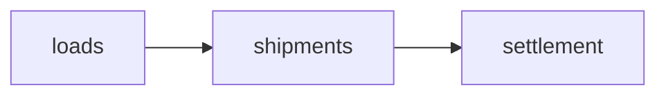

# Cell documentation and OpenAPI

This spec is the locked handoff. The next map implements it.

This map does not build the factory. This map does not add an OpenAPI crate. This map does not write repo-root handbook files, `CONTEXT-MAP.md`, cell glossaries, or `docs/openapi/openapi.json`. Fenced blocks below are the files the next map copies.

Law stays in [docs/architecture.md](../../docs/architecture.md) and [docs/adr/](../../docs/adr/). This spec proposes the OpenAPI law change. It does not apply it.

## Products

Two products. Two audiences. They do not share an entrypoint.

The maintainer handbook explains what each cell does, how it works, and how it talks to others. The lead is freight-plain.

OpenAPI covers every public REST endpoint. API consumers fetch it.

`CONTEXT.md` stays a glossary. `CONTEXT-MAP.md` and per-cell `CONTEXT.md` are glossary files. The handbook is a separate narrative layer. The maintainer entrypoint links both.

## Writing

1. The handbook is Diátaxis explanation. It is not a tutorial, how-to, or API map.
2. One job per source. The handbook owns narrative. Glossaries own terms. Law owns mechanics. OpenAPI owns public REST. Link the others.
3. The lead is freight-plain. It states what the cell owns and does not own. It names no crate path and no port.
4. How it works lists edges, then why. Why links law. It does not rewrite law.
5. Name the actor. After the lead, use glossary terms.
6. Scan, then stop. Short headings. Short paragraphs. Sentence-case headings.
7. Stale beats missing. A page that names a port the cell no longer exports is a bug.
8. Keep modes apart. Port lists stay lists. Why stays prose. No FAQ heading.

Length is a writing contract. It is not a CI gate.

Sources: [research/01-good-maintainer-docs.md](research/01-good-maintainer-docs.md).

## Handbook layout

Sources live under `docs/handbook/`. They do not sit next to crates.

```
docs/handbook/README.md
docs/handbook/cells/<cell>.md
docs/handbook/kernel.md
docs/handbook/app.md
```

The maintainer entrypoint is `docs/handbook/README.md`. It is the start page. It is not `app`. It is not the TOC.

A domain folder is not a handbook path segment. There is no `docs/handbook/freight/`.

A cell page is `docs/handbook/cells/<cell>.md`. This spec fills `loads` only. `shipments` and `settlement` stay graph nodes. They do not get handbook pages on this map.

Kernel and `app` are short pages. They are not cells. They are links under the graph, not nodes.

The start page does not present OpenAPI. Cell glossary files stay out of this tree. The TOC filename waits on the site generator.

## Cell page template

Copy to `docs/handbook/cells/<cell>.md`.

Title is the cell name. Lead is untitled and freight-plain. Lead is at most 120 words. Page is at most 500 words. A page over 800 words is a spec reject.

No headings for ticks, Work, unpublished ports, HTTP, or rustdoc. A tick or Work drain is one sentence under How it works.

Open Host bullets omit PL structs, envelope variants, REST paths, and unpublished ports. Write SPIs and read SPIs do not appear.

An Open Host bullet is the port name plus one-line intent. A Leaving SPIs bullet is an other-cell consumer SPI, an `IntegrationEventSink`, or a vendor SPI. An empty leaving list is the line `None.` Persistence is one sentence: this cell owns the `<cell>` schema.

An invariant is one sentence. Terms link to the cell glossary. Identity and communication stay links to law.

```markdown
# <cell>

<untitled lead, ≤120 words: freight-plain owns / does not own. No crate paths, no ports.>

## How it works

### Open Host

- <port> — <intent>

### Leaving SPIs

- None.

This cell owns the `<cell>` schema.

<why prose: why these edges, where a hop goes. Link law. Do not rewrite it.>

## Invariants

- <one sentence>
- <one sentence>

## See also

- Cell glossary
- Context map
- ADRs this page actually cites
```

## Kernel and app template

Both pages share this skeleton. Not the cell skeleton. No Open Host. No Leaving SPIs. No Invariants. No schema sentence. No ticks, Work, HTTP, rustdoc, or file-tree headings.

Lead is hive-plain. No crate path. No file list. Lead is at most 80 words. Page is at most 200 words. A page over 400 words is a spec reject.

How it works names groups, one line each, then one why sentence that links law. Exclusive export list, forbidden list, layer-import matrix, import wall, and `app` file tree stay in law.

## Start page

Copy to `docs/handbook/README.md`. Relative links are from `docs/handbook/`.

````markdown
# Handbook

This hive brokers freight between Shippers and Carriers. A Shipper posts a Load. A Carrier answers with a Quote. A booked Load becomes a Shipment. Settlement invoices the Shipper and pays the Carrier.



- [loads](cells/loads.md)
- [Context map](../../CONTEXT-MAP.md)
- [kernel](kernel.md)
- [app](app.md)
- [Architecture](../architecture.md)
- [ADRs](../adr/)
````

Graph nodes are cells. First-cut nodes are `loads`, `shipments`, and `settlement`. Arrows are cell-to-cell hops at that grain. The start page does not restate [Communication](../../docs/adr/0005-communication.md). It does not present OpenAPI. It does not rewrite law. No `.scratch/` links.

## kernel page

Copy to `docs/handbook/kernel.md`.

```markdown
# kernel

Kernel holds shared types and ports every cell may use. It is not a cell. It has no Open Host and no schema.

## How it works

- Money and Instant — shared value objects
- Clock — application reads now
- Logger and Metrics — bound on cell `new`
- Violation — payload on `VALIDATION_FAILED`

Cells import these. Kernel never imports a cell. See [Shared kernel](../architecture.md#15-shared-kernel).

## See also

- [Shared kernel](../architecture.md#15-shared-kernel)
- [Shared kernel ADR](../adr/0016-shared-kernel.md)
- [CONTEXT.md](../../CONTEXT.md)
```

## app page

Copy to `docs/handbook/app.md`.

```markdown
# app

`app` is the composition root that starts the hive. It is not a cell. It is not the gateway. It does not issue AuthN.

## How it works

- migrate and serve — the two process entries
- binds cells, InProc, named pools, Clock, Logger, and Metrics
- merges OpenAPI and does not serve it
- `GET /health` is served and off the spec

Cells never import `app`. Tests never boot `app`. See [Composition root](../architecture.md#3-composition-root).

## See also

- [Composition root](../architecture.md#3-composition-root)
- [Composition root ADR](../adr/0004-composition-root.md)
- [REST](../adr/0009-rest.md)
```

## loads handbook page

Copy to `docs/handbook/cells/loads.md`. Relative links are from that file.

```markdown
# loads

`loads` holds a Shipper's posted demand to move freight from origin to destination. A Carrier answers with a Quote. This cell owns that demand, the Quote, and the Stops. Booking is not this cell's job. That move becomes a Shipment elsewhere.

## How it works

### Open Host

- createLoad — post a Load

### Leaving SPIs

- None.

This cell owns the `loads` schema.

Posting demand is this cell's write. Quote is in the language and not yet an Open Host port. Book is not on this cut, so no leaving SPI points at shipments. See [Communication](../../adr/0005-communication.md). See [Freight](../../adr/0017-freight.md).

## Invariants

- A [Load](../../../crates/cells/freight/loads/CONTEXT.md) has two [Stops](../../../crates/cells/freight/loads/CONTEXT.md) on the first cut: one pickup and one delivery.
- [Consignee](../../../crates/cells/freight/loads/CONTEXT.md) is a name on the delivery stop, not a party.
- Delivery date is not before pickup date.

## See also

- [loads glossary](../../../crates/cells/freight/loads/CONTEXT.md)
- [Context map](../../../CONTEXT-MAP.md)
- [Communication](../../adr/0005-communication.md)
- [Freight](../../adr/0017-freight.md)
```

## CONTEXT-MAP.md

Copy to repo-root `CONTEXT-MAP.md`. Two headings. No mermaid. No Open Host list. No SPI list. No REST. No kernel node. No `app` node. No domain-folder node. No term dump.

A context row is the cell name, one purpose clause, and a link to that cell `CONTEXT.md` when the file exists. `shipments` and `settlement` are named-only: purpose clause, no link, no empty glossary, no invented crate.

A relationship row names the contact and the hive words for the pattern. Shared Kernel stays off this file. Money and Instant live in root `CONTEXT.md` and [Shared kernel](../../docs/adr/0016-shared-kernel.md).

```markdown
# Context Map

## Contexts

- [loads](./crates/cells/freight/loads/CONTEXT.md) — Shipper posted demand to move freight from origin to destination
- shipments — contracted move after a Load is booked with a Carrier
- settlement — Invoice to the Shipper and Payable to the Carrier

## Relationships

- **loads → shipments**: loads emits `Book` (integration event, Published Language). shipments receives it on its own API port. Consumer SPI plus InProc is the anticorruption layer.
- **shipments → settlement**: settlement keeps a local read model of CustomerRate and CarrierRate locked on the Shipment at book.
```

## loads CONTEXT.md

Copy to `crates/cells/freight/loads/CONTEXT.md`. Title, one or two sentences of what this context is, then `## Language` with `**Term**` / definition / `_Avoid_`.

Terms: Load, Quote, Stop, Consignee, Shipper, Carrier. Quote is in even though the crate has no Quote aggregate yet. Shipper and Carrier are restated here.

This file does not hold Shipment, Invoice, Payable, CustomerRate, or CarrierRate. It does not list Open Host. It does not write invariant essays.

```markdown
# loads

This context is a Shipper's posted demand to move freight from origin to destination. A Carrier answers with a Quote.

## Language

**Load**:
A Shipper's posted demand to move freight from origin to destination.
_Avoid_: Order, job, tender as this noun, Shipment

**Quote**:
A Carrier's priced offer on a Load.
_Avoid_: Bid, Rate as this noun, a shipper-facing quote aggregate

**Stop**:
A pickup or delivery location on a Load. First cut is two.
_Avoid_: Leg, unstructured origin and destination fields

**Consignee**:
The receiving name and address on a destination stop. Not a party with identity.
_Avoid_: Consignee aggregate, treating Consignee as a Shipper

**Shipper**:
The party that posts a Load.
_Avoid_: Customer, client, account

**Carrier**:
The party that hauls a Shipment.
_Avoid_: Trucker, vendor, supplier
```

## Root CONTEXT.md

When the `loads` glossary lands, root `### Freight` drops Load, Quote, Stop, Consignee, Shipper, and Carrier.

It keeps Shipment, CustomerRate, CarrierRate, Invoice, and Payable until those cell glossaries exist. Then the heading goes.

Root `CONTEXT.md` keeps hive process and kernel. This map does not edit that file.

## OpenAPI law

The next map reopens chapter 8 and [Stack pins](../../docs/adr/0001-stack-pins.md). It does not reopen other chapters.

### Chapter 8

Replace "No OpenAPI crate pin." with the pins and the presentation duty.

Pin `utoipa` 5 and `utoipa-axum` 0.2. Exact versions live in [Stack pins](../../docs/adr/0001-stack-pins.md). `utoipa` lives in `domain/api` and cell `presentation/`. `utoipa-axum` lives in cell `presentation/` only.

`lib.rs` re-exports `pub fn router` as `utoipa_axum::router::OpenApiRouter`. Public REST uses `routes!(handler)` with no turbofish. Unpublished REST uses `OpenApiRouter::route`. It is served and absent from the spec.

Public REST handlers carry `#[utoipa::path]`. Unpublished REST is not annotated. Published Language in `domain/api` derives `ToSchema` beside `Deserialize`, `Serialize`, and `Validate`. Envelope types do not derive `ToSchema`. The public error document is presentation's RFC 9457 `Problem`. `domain/entities`, `domain/spi`, and `application/` never name `utoipa`.

`app` starts from `OpenApiRouter::with_openapi(AppApi::openapi())`. `AppApi` carries `info` and `servers`. `info.title` is `Barti Freight`. `info.version` is `0.1.0`. One `servers` entry: `url` is `/`. `app` `merge`s each cell router. It does not `nest`. It calls `split_for_parts()` once, then layers middleware on the axum `Router`. `GET /health` stays on that router and off the spec. Cells declare no `servers`. Starting the merge from `OpenApiRouter::new()` is forbidden.

Operations are tagged with the cell name. Schema names and `operationId`s are unique across cells. Collision is a review reject. `Problem` is the one shared component name. Each cell presentation defines that type with chapter 8's fields. Merge is first-wins. After merge, `app` injects 401 and 500 onto every public operation. Cells document the statuses they choose.

Consumers fetch `docs/openapi/openapi.json` from git at the ref they integrate against. The file is the one document `app` assembled. It is pretty JSON. Stable keys. A generator in `app` writes it. Nobody edits it by hand. Cell tags stay inside it. `app` does not serve it. GitHub Releases do not carry a copy. This process does not serve Swagger UI.

Ignore `RUSTSEC-2024-0436` for transitive `paste` until the pin bumps to a pastey `utoipa-axum`. Do not set `unmaintained = "workspace"`.

The inject mechanism is implementation. OpenAPI versioning and compatibility stay fog.

### Architecture stack pins

Add majors:

| Pin | Major |
| --- | --- |
| `utoipa` | 5 |
| `utoipa-axum` | 0.2 |

Drop "an OpenAPI crate" from the not-pinned list.

### ADR 0001

Drop "No OpenAPI crate" from Not pinned.

Add rows:

| Crate or tool | Version | Home |
| --- | --- | --- |
| `utoipa` | 5.5.0 | `domain/api`, cell `presentation/` |
| `utoipa-axum` | 0.2.0 | cell `presentation/` only |
| oasdiff | implementation pin | CI |
| oasdiff-action | implementation pin | CI |
| lychee | implementation pin | CI |
| lychee-action | implementation pin | CI |

Exact oasdiff and lychee versions are the implementation pin. Same law change as the OpenAPI crate pin.

## loads OpenAPI slice

The committed file is generated. This slice is the contract for `POST /loads` after merge. Extra generated fields are allowed. Missing this operation, its `loads` tag, or these statuses is a fail.

`operationId` is `create_load`. Schema property names are the JSON names. Envelope types stay out.

```json
{
  "openapi": "3.1.0",
  "info": {
    "title": "Barti Freight",
    "version": "0.1.0"
  },
  "servers": [
    {
      "url": "/"
    }
  ],
  "tags": [
    {
      "name": "loads"
    }
  ],
  "paths": {
    "/loads": {
      "post": {
        "tags": ["loads"],
        "operationId": "create_load",
        "parameters": [
          {
            "name": "Idempotency-Key",
            "in": "header",
            "required": true,
            "schema": {
              "type": "string",
              "minLength": 1,
              "maxLength": 255
            }
          }
        ],
        "requestBody": {
          "required": true,
          "content": {
            "application/json": {
              "schema": {
                "$ref": "#/components/schemas/CreateLoadInput"
              }
            }
          }
        },
        "responses": {
          "201": {
            "description": "Load created",
            "content": {
              "application/json": {
                "schema": {
                  "$ref": "#/components/schemas/LoadResource"
                }
              }
            }
          },
          "400": {
            "description": "VALIDATION_FAILED",
            "content": {
              "application/problem+json": {
                "schema": {
                  "$ref": "#/components/schemas/Problem"
                }
              }
            }
          },
          "401": {
            "description": "UNAUTHENTICATED",
            "content": {
              "application/problem+json": {
                "schema": {
                  "$ref": "#/components/schemas/Problem"
                }
              }
            }
          },
          "409": {
            "description": "LOAD_CONFLICT",
            "content": {
              "application/problem+json": {
                "schema": {
                  "$ref": "#/components/schemas/Problem"
                }
              }
            }
          },
          "500": {
            "description": "Internal server error",
            "content": {
              "application/problem+json": {
                "schema": {
                  "$ref": "#/components/schemas/Problem"
                }
              }
            }
          }
        }
      }
    }
  },
  "components": {
    "schemas": {
      "CreateLoadInput": {
        "type": "object",
        "required": ["shipperId", "stops"],
        "additionalProperties": false,
        "properties": {
          "shipperId": { "type": "string", "minLength": 1 },
          "stops": {
            "type": "array",
            "minItems": 2,
            "maxItems": 2,
            "items": { "$ref": "#/components/schemas/StopInput" }
          }
        }
      },
      "StopInput": {
        "type": "object",
        "required": ["kind", "date", "address"],
        "additionalProperties": false,
        "properties": {
          "kind": { "$ref": "#/components/schemas/StopKindPl" },
          "date": { "type": "string", "description": "YYYY-MM-DD" },
          "name": { "type": ["string", "null"], "minLength": 1 },
          "address": { "$ref": "#/components/schemas/AddressInput" }
        }
      },
      "AddressInput": {
        "type": "object",
        "required": ["line1", "city", "region", "postalCode", "country"],
        "additionalProperties": false,
        "properties": {
          "line1": { "type": "string", "minLength": 1 },
          "line2": { "type": ["string", "null"], "minLength": 1 },
          "city": { "type": "string", "minLength": 1 },
          "region": { "type": "string", "minLength": 1 },
          "postalCode": { "type": "string", "minLength": 1 },
          "country": { "type": "string", "minLength": 2, "maxLength": 2 }
        }
      },
      "StopKindPl": {
        "type": "string",
        "enum": ["pickup", "delivery"]
      },
      "LoadResource": {
        "type": "object",
        "required": ["id", "shipperId", "stops", "createdAt"],
        "properties": {
          "id": { "type": "string" },
          "shipperId": { "type": "string" },
          "stops": {
            "type": "array",
            "items": { "$ref": "#/components/schemas/StopResource" }
          },
          "createdAt": { "type": "string", "description": "RFC 3339 UTC instant" }
        }
      },
      "StopResource": {
        "type": "object",
        "required": ["id", "kind", "date", "address"],
        "properties": {
          "id": { "type": "string" },
          "kind": { "$ref": "#/components/schemas/StopKindPl" },
          "date": { "type": "string", "description": "YYYY-MM-DD" },
          "name": { "type": "string" },
          "address": { "$ref": "#/components/schemas/AddressResource" }
        }
      },
      "AddressResource": {
        "type": "object",
        "required": ["line1", "city", "region", "postalCode", "country"],
        "properties": {
          "line1": { "type": "string" },
          "line2": { "type": "string" },
          "city": { "type": "string" },
          "region": { "type": "string" },
          "postalCode": { "type": "string" },
          "country": { "type": "string" }
        }
      },
      "Problem": {
        "type": "object",
        "required": ["type", "status", "detail", "instance"],
        "properties": {
          "type": { "type": "string", "description": "Envelope type string, not a URI" },
          "status": { "type": "integer" },
          "detail": { "type": "string" },
          "instance": { "type": "string" },
          "correlationId": { "type": "string" },
          "violations": {
            "type": "array",
            "items": {
              "type": "object",
              "required": ["path", "code", "message"],
              "properties": {
                "path": { "type": "string" },
                "code": { "type": "string" },
                "message": { "type": "string" }
              }
            }
          }
        }
      }
    }
  }
}
```

`GET /health` is absent. `actorId` is absent from `LoadResource`. `Problem` has no `title` and no `context`.

## CI contract

Five blocking checks, all mechanical, all steps on the existing `ci` job. `.github/rulesets/protect-main.json` gains `required_status_checks` for `ci` and `check`, with `strict_required_status_checks_policy` false. Prose taste is not a gate. Page length is not a gate.

This map does not add the workflow.

### `scripts/check-docs`

Path equality. Cell name is the last directory of `crates/cells/*/*/Cargo.toml`.

It requires:

- `docs/handbook/README.md`
- `docs/handbook/kernel.md`
- `docs/handbook/app.md`
- repo-root `CONTEXT-MAP.md`
- `docs/handbook/cells/<cell>.md` for every cell crate
- `<crate>/CONTEXT.md` for every cell crate
- that `CONTEXT-MAP.md` contains the relative path to that `CONTEXT.md`

A handbook cell page with no crate fails. Named-only `CONTEXT-MAP.md` rows without links stay legal.

Closed trees. `docs/handbook/` may contain only those files. `docs/openapi/` may contain only `openapi.json`.

### OpenAPI drift

A generator in `app` writes `docs/openapi/openapi.json`. Pretty JSON. Stable keys. Nobody edits it by hand. CI regenerates, then `git diff --exit-code -- docs/openapi/openapi.json`.

### oasdiff

`oasdiff validate` runs on that file.

`oasdiff breaking` compares `origin/${{ github.base_ref }}:docs/openapi/openapi.json` to `HEAD:docs/openapi/openapi.json`, `fail-on: ERR`, `review: false`. Skip when the path is missing on the base ref.

### lychee

`lychee --offline --include-fragments` runs on `docs/handbook/**/*.md`, `docs/architecture.md`, `docs/adr/**/*.md`, `CONTEXT.md`, `CONTEXT-MAP.md`, and `crates/cells/**/CONTEXT.md`. Not `.scratch/`. Not `AGENTS.md`.

### nextest

Two cargo tests ride the existing nextest step.

Coverage instantiates each cell router `app` merges: every operation in that cell OpenApi is tagged with the cell name; the merged document contains those operations; a cell with no public routes contributes no tag and passes; `GET /health` is absent from the spec.

Problem identity: before merge, among cell OpenApis that emit `components.schemas.Problem`, that schema JSON is identical.

### Not gates

External link rot does not block. `oasdiff changelog` may write the job summary. No weekly workflow on this map. Vale, markdownlint, LLM prose review, `typos`, rustdoc intra-doc links, and handbook-to-OpenAPI coupling are not gates.

## Out of this spec

- Building the factory or emitting OpenAPI.
- Adding `utoipa` to presentation on this map.
- Site generator and handbook tooling.
- Prose linter.
- OpenAPI versioning and compatibility.
- Handbook pages for `shipments` and `settlement`.
- Whether `review-change` learns a docs axis.
- CODEOWNERS and GitHub review requests.
- Serving Swagger UI from the hive process.
- Agent-facing docs, `AGENTS.md`, layer rules, and skills.
- Rewriting `docs/architecture.md` into the handbook.

## Next map

Implementation is done when all of these hold.

Handbook files exist at the layout paths. The start page, kernel page, app page, and `loads` page match the fenced copies. `CONTEXT-MAP.md` and `crates/cells/freight/loads/CONTEXT.md` match the fenced copies. Root `### Freight` has dropped the six `loads` terms.

Chapter 8 and ADR 0001 carry the OpenAPI law change. Architecture majors list `utoipa` 5 and `utoipa-axum` 0.2.

Cell `router` returns `OpenApiRouter`. `app` merges, owns `info`, and writes `docs/openapi/openapi.json`. The committed file contains the `loads` slice contract. `app` does not serve it.

The five CI checks run on the `ci` job. `protect-main.json` requires `ci` and `check`. Coverage and Problem identity tests pass.
