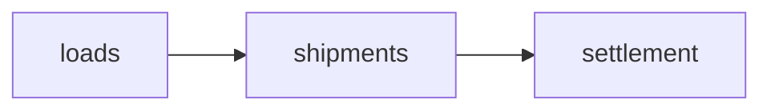

# Handbook

This hive brokers freight between Shippers and Carriers. A Shipper posts a Load. A Carrier answers with a Quote. A booked Load becomes a Shipment. Settlement invoices the Shipper and pays the Carrier.

- [loads](cells/loads.md)
- [Context map](../../CONTEXT-MAP.md)
- [kernel](kernel.md)
- [app](app.md)
- [Architecture](../architecture.md)
- [ADRs](../adr/)
